# Figure Creation — Mermaid-First Cookbook

How to design figures that earn their space. Mermaid is the default authoring format because it is text (reviewable, diff-able, version-controllable), deterministic, and renders in `marp-slides`, GitHub, GitLab, MkDocs, Notion, and most Markdown environments.

## The Information Test (apply *before* drawing)

> If I deleted the shapes and arrows and left only the text, what would I lose? If "nothing meaningful," it is not a diagram — it is bullets in costume.

When the test fails, choose:
1. **Delete** the diagram and present the content as text or a list.
2. **Replace** with a chart if the content is data-driven.
3. **Actually encode the structure** — process / hierarchy / matrix / sequence / state / ER / C4 — with arrows that mean *one* consistent thing (data flow OR dependency OR time — pick one).

This is the same test enforced by `pptx-design`. Decorated bullets, default-SmartArt theater, decorative arrows, mismatched abstraction levels, and "center-and-spokes with unrelated spokes" all fail it.

### Worked example — fails the test

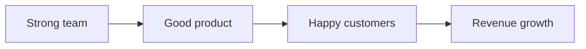

If you delete the boxes and arrows you get: "Strong team. Good product. Happy customers. Revenue growth." That is a bullet list. The arrows imply causation that the source did not establish. **Delete and present as bullets.**

### Worked example — passes the test

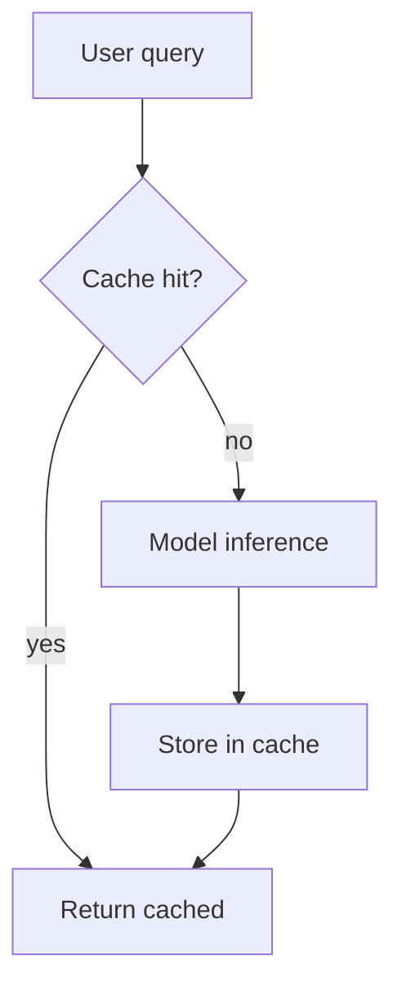

Removing the shapes loses the **branching** (cache hit vs miss) and the **feedback** (store-then-return). The structure carries information. **Keep.**

## Diagram Type Cookbook

One minimal example per type. Copy, modify, ship.

### `flowchart` — process or decision flow

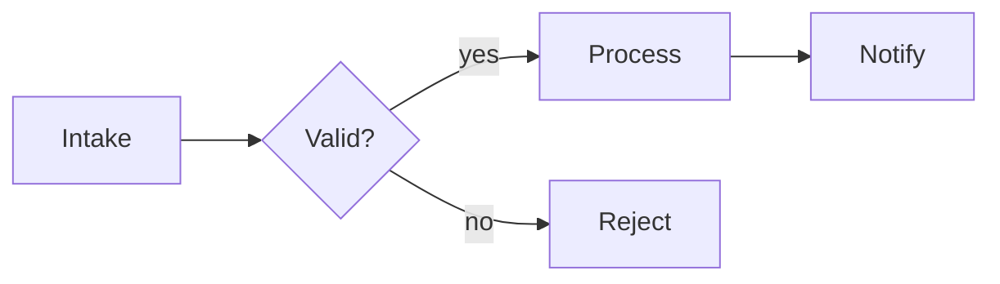

Use `TD` (top-down) for hierarchical flows; `LR` (left-right) for horizontal pipelines. Use diamonds `{}` for decisions, rectangles `[]` for steps, parallelograms `[/.../]` for I/O.

### `sequenceDiagram` — actor interactions over time

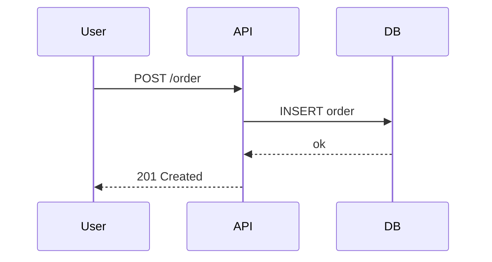

Solid arrow `->>` for synchronous; dashed `-->>` for replies; `Note over X` for annotations.

### `stateDiagram-v2` — state machine

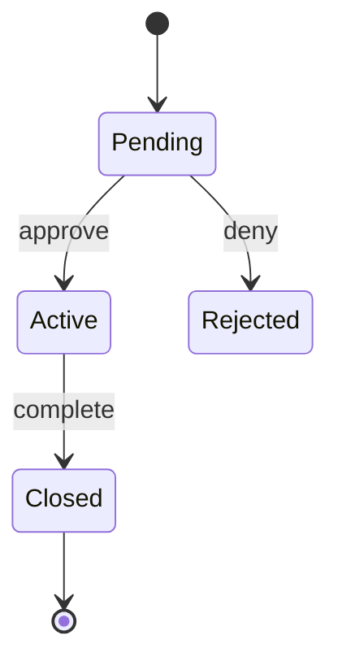

### `erDiagram` — entities + relationships

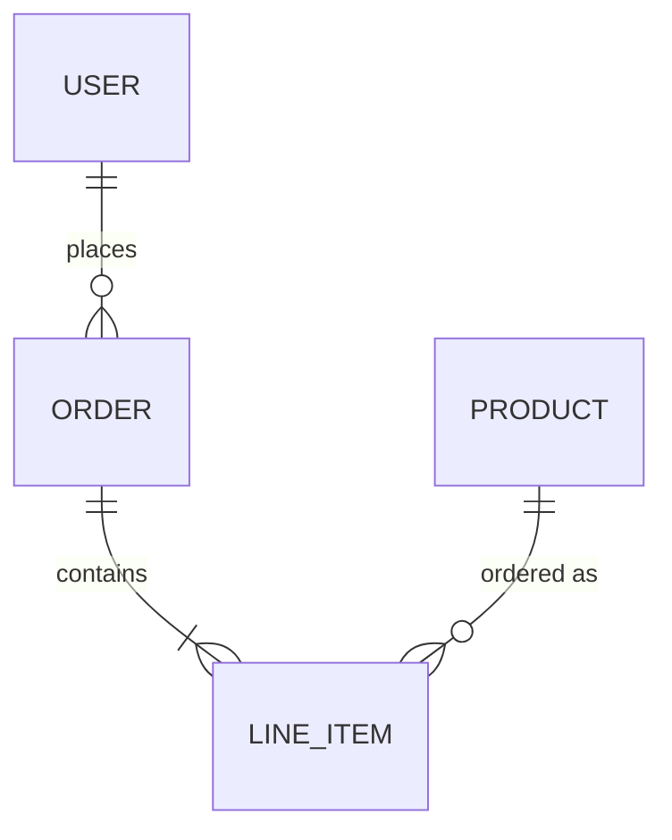

Cardinality: `||--||` one-to-one; `||--o{` one-to-many; `}o--o{` many-to-many.

### `mindmap` — hierarchy / breakdown

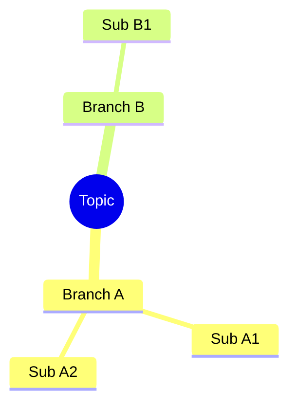

### `quadrantChart` — 2×2 positioning

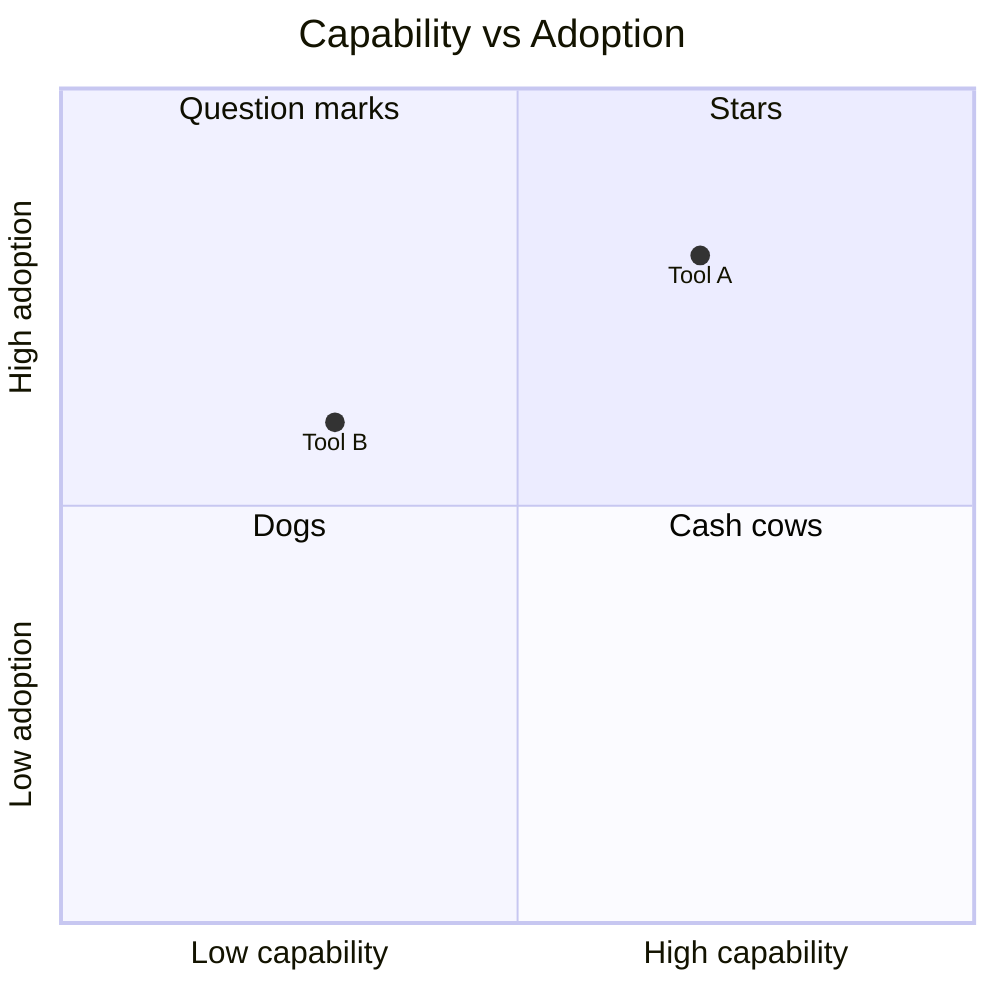

### `timeline` — time-ordered events

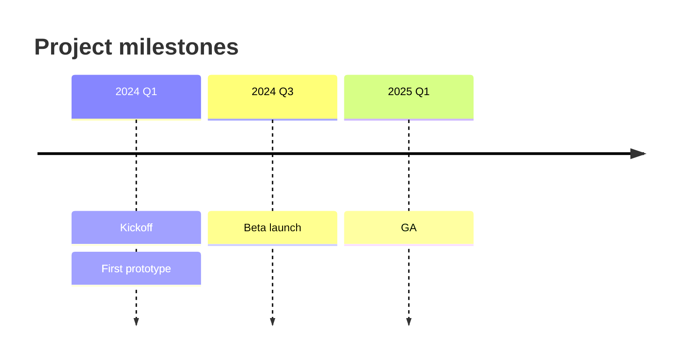

### `gantt` — time-ordered work with durations

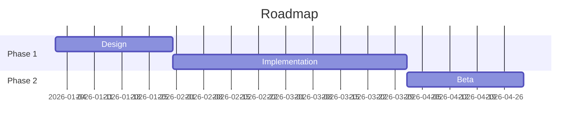

### `pie` — categorical share

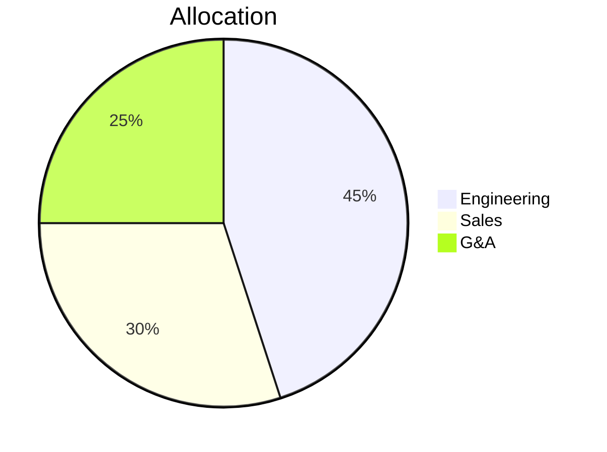

Use sparingly; bar charts are usually clearer for ≥4 categories.

### `xychart-beta` — XY data

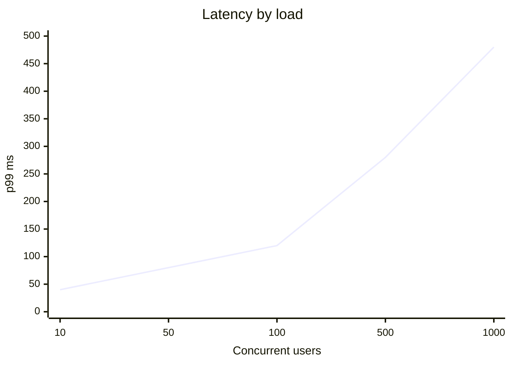

For arbitrary data viz, prefer chaining `data-analyst` (matplotlib/plotly).

### `sankey-beta` — flow volumes

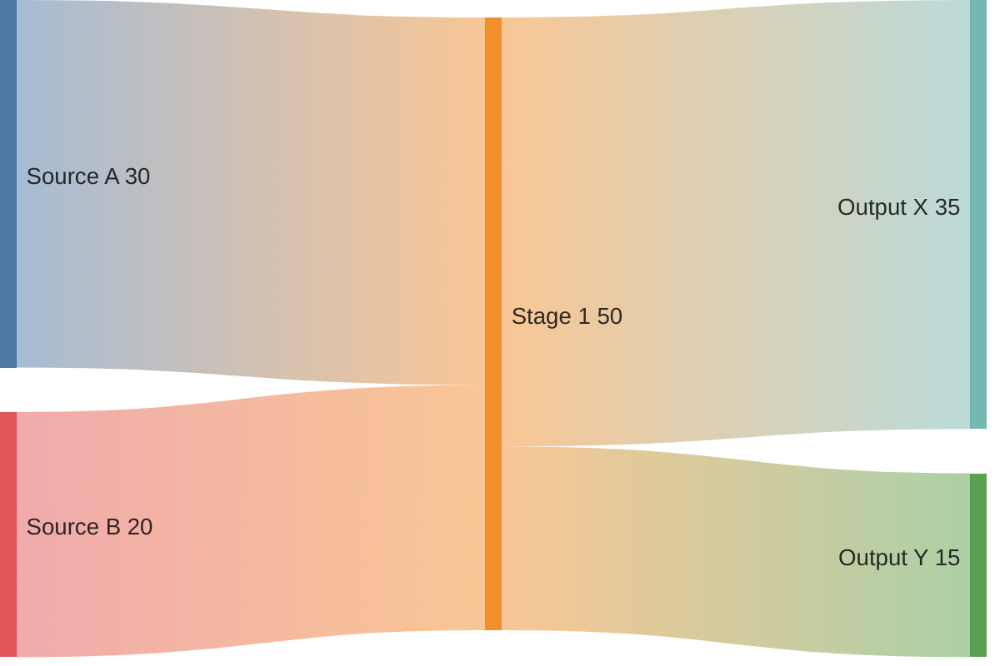

## Comparison Matrices — Use Markdown Tables, Not Mermaid

Mermaid's matrix layouts are weak. For side-by-side comparison, write a Markdown table:

```markdown
| Tool | Cost | Latency | Lock-in |
|---|---|---|---|
| A | $$ | low | medium |
| B | $$$ | low | high |
| C | $ | medium | low |
```

This is a "figure" in the Figure Ledger sense even though it is text. Cite it with `F-NN, table` in the source_reference.

## Anti-Patterns

| Pattern | Problem | Fix |
|---|---|---|
| **Decorated bullets** | Boxes around items with arrows that mean nothing | Information test → delete or replace with real structure |
| **SmartArt theater** | Default templates with vague labels (Process! Cycle!) used as filler | Choose a diagram type that actually fits the data |
| **Decorative arrows** | Arrows whose meaning shifts within one diagram (sometimes flow, sometimes dependency) | Pick one semantic; add a legend |
| **Mismatched abstraction** | "Cloud" + function name + buzzword in one diagram | One level; stay there |
| **Center-and-spokes with unrelated spokes** | Hub-and-spoke layout when items are not actually related to a center | Use a list, table, or mindmap |
| **Ten-shape diagrams** | Cognitive overload | 5±2 nodes; split into multiple diagrams |
| **Mystery legend** | Different shapes / colors / line styles with no explanation | Always include a legend if encoding semantically |
| **Chartjunk** | 3D, gradients, drop shadows, decorative backgrounds | Tufte data-ink ratio; keep it flat |
| **Unrooted abstractions** | Nodes labeled "synergy", "alignment", "transformation" | If you cannot point to a system component or process step, do not draw it |

For chart-specific design (data-ink, encoding choice, scale honesty), see `pptx-design/references/data-visualization.md` — do not duplicate here.

## Authoring Checklist

Before emitting a Mermaid file:

1. ☐ Information test passes — removing shapes loses information
2. ☐ Arrow semantic is single and stated (in title or as legend)
3. ☐ Abstraction level is consistent across all nodes
4. ☐ ≤ 9 nodes (split if more)
5. ☐ Every node label is concrete (no "synergy", no "alignment")
6. ☐ Linked to one or more Claim Ledger IDs
7. ☐ Caption written, marked `[reconstructed]` if not from source

## SVG-Direct Fallback

When Mermaid does not render what you need (complex network topology, custom symbols, very dense layout), write minimal SVG instead:

```xml
<svg xmlns="http://www.w3.org/2000/svg" viewBox="0 0 400 200">
  <rect x="10" y="10" width="100" height="60" fill="none" stroke="black"/>
  <text x="60" y="45" text-anchor="middle">Component A</text>
  <line x1="110" y1="40" x2="200" y2="40" stroke="black" marker-end="url(#arrow)"/>
  <defs>
    <marker id="arrow" viewBox="0 0 10 10" refX="10" refY="5" markerWidth="6" markerHeight="6" orient="auto">
      <path d="M0,0 L10,5 L0,10 z"/>
    </marker>
  </defs>
</svg>
```

SVG is text, version-controllable, and renders inline in Markdown. Treat it the same as Mermaid in the Figure Ledger.

## Rasterization

Default: emit Mermaid `.mmd` source only. The downstream consumer (`marp-slides`, GitHub, etc.) renders it.

When PNG/SVG is required (e.g., embedding in a `.pptx` via `pptx-design`, or sending an image to a non-Markdown consumer), use `scripts/render_mermaid.js`:

```bash
node scripts/render_mermaid.js mermaid/F-03.mmd --out figures/F-03.png --format png
```

This uses Puppeteer (already a marketplace dependency) and the bundled `assets/mermaid_template.html`. No additional npm package required.

If `assets/mermaid_template.html` cannot reach a CDN (offline / restricted environment), download `mermaid.min.js` from a known release into `assets/` and edit the template's script tag to reference the local file. Document the version pinned.
